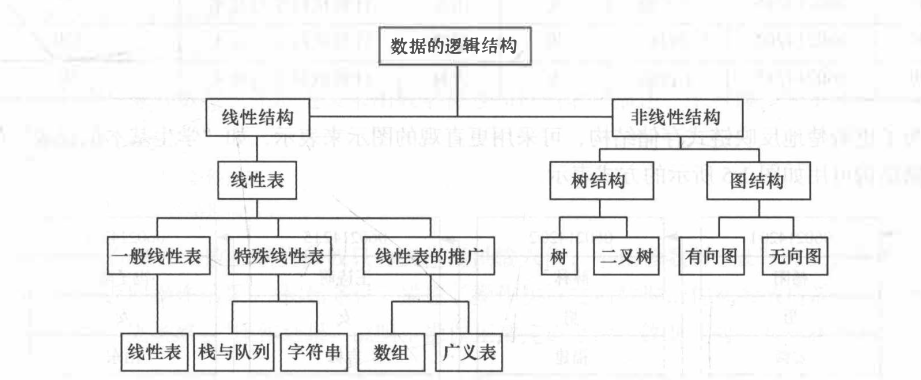

## 数据结构笔记

### 基本概念和术语

**数据**：客观事物的符号表示，是所有能输入到计算机中并被计算机程序处理的符号的总称。  
**数据元素**：数据的基本单位，在计算机中通常作为一个整体进行考虑和处理。  
**数据项**：组成数据元素的，有独立含义的、不可分割的最小单位。  
**数据对象**：性质相同的数据元素集合，是数据的一个子集。  
**数据结构**：相互之间存在一种或多种特定关系的数据元素的集合。  
1. 逻辑结构
   - 从逻辑关系上描述数据，它与数据存储无关，是独立于计算机的。
2. 存储结构
   - 数据对象在计算机中的存储表示。

**逻辑结构**

要素：
1. 数据元素
2. 关系

四类基本结构：
1. 集合结构
2. 线性结构
3. 树结构
4. 图结构或网状结构

*非线性结构（集合结构，树结构，图结构或网状结构）*

**存储结构**  
> 也称为 *物理结构*
1. 顺序存储结构
2. 链式存储结构
   
顺序存储结构要求所有元素依次存放在一片连续的存储空间中，而链式存储将结构，无需占用一整块存储空间，但需要为每个结点附加指针字段。

### 算法和算法分析

**算法**五个重要特性
1. 有穷性。
2. 确定性。
3. 可行性。
4. 输入。有零个或多个输入。
5. 输出。有一个或多个输出。

**算法优劣评价**

1. 正确性
2. 可读性
3. 健壮性
4. 高效性

**算法的时间复杂度**
$$ T(n) = O(f(n)) $$
**算法的空间复杂度**
$$ S(n) = O(f(n)) $$

